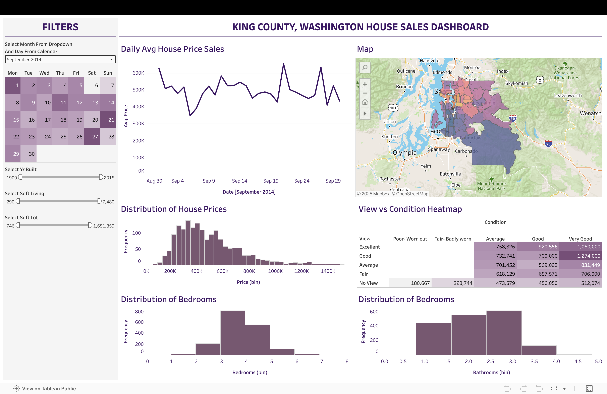

# King County House Sales Dashboard

An interactive Tableau dashboard exploring **house sales in King County, WA**, with filters for year, month, zipcode, and property features.

## 🔍 Key Highlights
- **KPIs:** Median price, average square footage, total sales.
- **Filters:** Year, month, zipcode, bedrooms/bathrooms, waterfront status.
- **Maps & Trends:** Price distribution by location and seasonal sales patterns.
- **Interactive Analysis:** Drill down into specific areas or property types.

## 🌐 Live Dashboard
[View on Tableau Public](https://public.tableau.com/app/profile/krishna.chaitanya.chigurupati/viz/KingCountyHouseSalesDashboard_17564335014740/HouseSalesDashboard)
